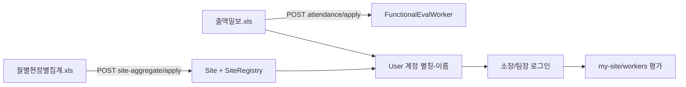
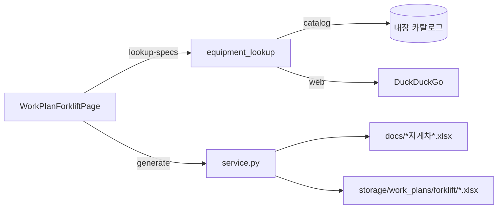

# BESMA 핸드오프 — 2026-06-04

> **대상:** 다음 세션·외부 조정자·배포 담당자  
> **워크스pace:** `d:\JSI\besma-rev` (FastAPI + Vue3 + SQLite)  
> **포트:** backend `8001`, frontend `5174`

---

## 1. 이번 스프린트 방향 (Where we are going)

### 1-A. 기능인제 인사고과 — ERP 연동 PoC

**목표:** HQ가 ERP `.xls` 두 종만 업로드하면, 현장 소장·팀장·근로자 계정과 평가 대상이 자동 구성되고, 소장/팀장이 `별칭-이름` + 주민번호 앞 6자리로 로그인해 평가한다.

| 단계 | 입력 파일 | 역할 |
|------|-----------|------|
| ① 집계 | `월별현장별집계_*.xls` | BESMA `Site` + `FunctionalEvalSiteRegistry` (현장코드·현장명·소장) |
| ② 출역 | `출역일보_*.xls` | 당일 출역 근로자 + `User` 계정 자동 발급 + 평가 대상 등록 |

**로그인 규칙 (확정):**

- ID = `{현장별칭}-{이름}` — 예: `대우청라-박명식`, `금호마곡-이성영`
- PW = 출역일보 **B열 주민번호 앞 6자리**
- 20명 이하 현장: 소장이 전원 평가 / **21명 초과:** 출역일보 **팀장 열** 기준 분산 평가

**PoC 동선:**

```
hq01 로그인 → /hq-safe/functional-eval
  → ① 월별현장별집계 업로드·반영
  → ② 출역일보 업로드·반영
  → 대우청라-박명식 등으로 로그인 → 평가 화면
```

### 1-B. 지게차 작업계획서 — 웹 입력 → 엑셀 생성

**목표:** 현장 메뉴에서 작업계획서 양식을 웹으로 채우고, 템플릿 서식을 유지한 채 `.xlsx`를 생성·다운로드한다.

| UX | 내용 |
|----|------|
| 고정값 (수정 가능) | `(주)부현전기`, 오늘 날짜, 현장명, 작업명, 작업기간 등 **미리 채움** |
| 장비 필드 | 모델명·등록번호·제작년도·정격하중 등 **빈 칸 + 회색 placeholder 예시** |
| 자동 조회 | 모델명 입력 시 내장 카탈로그 → 없으면 웹 검색으로 정격하중·제원 자동 채움 (빈 필드만) |

**PoC 동선:**

```
현장 로그인 → /site/work-plan-forklift
  → 모델명 50DN-9VB 입력 → 정격하중·제원 자동 채움
  → 엑셀 생성·저장 → 다운로드
```

---

## 2. 병목 · 미완 · 리스크 (Bottlenecks)

### 🔴 즉시 확인 필요

| # | 병목 | 상세 | 권장 조치 |
|---|------|------|-----------|
| B1 | **마이그레이션 미적용 시 API 실패** | `20260604_0060_functional_eval_site_registry` 미적용이면 집계 반영 500 | `cd backend && alembic upgrade head` |
| B2 | ~~DECISION-089 문서 vs 코드 불일치~~ | ~~문서 20명 vs 코드 10명~~ | **2026-06-08 해결:** `TEAM_LEADER_SPLIT_THRESHOLD = 20` ([DECISION-089]) |
| B3 | ~~현장명 하드코딩~~ | ~~지게차 폼 `푸르지오스타셀라49현장`~~ | **2026-06-08 해결:** 로그인 `site_id` → `/sites/{id}` 현장명 자동 주입 |
| B4 | **웹 제원 조회 불안정** | DuckDuckGo HTML 파싱 — 네트워크·차단·스니펫 품질에 따라 실패 | 카탈로그 모델 확대, 제조사 API 검토 |

### 🟡 운영·품질

| # | 병목 | 상세 |
|---|------|------|
| B5 | 별칭 충돌 | 동일 별칭 현장은 site_code 접미사로 구분 (`site_alias.py`) — ERP 신규 현장명 패턴 추가 필요 시 `_PROJECT_TOKENS` 보강 |
| B6 | `.xls` 포맷 변형 | ERP export 컬럼·시트명 변경 시 `xls_io.py` / `site_aggregate.py` / `attendance.py` 파서 깨짐 |
| B7 | 템플릿 경로 | `docs/*지게차*.xlsx` glob — 파일명·시트명 `1. 지게차(일반)` 변경 시 service 실패 |
| B8 | 브라우저 E2E 미검증 | pytest는 통과, 실제 UI·다운로드·로그인 연동은 로컬 수동 확인 필요 |

### 🟢 다음 우선순위 (백로그)

1. 기능인제: 소장 계정 없는 현장 경고 → 명부 반영 후 계정 생성 UX 정교화
2. 지게차: 로그인 현장명 자동 주입, 카탈로그 모델 추가 (두산·현대·토요타 등)
3. `docs/BESMA_SESSION_STATE.md` §4 최근 이력 갱신 (본 핸드오프 반영)

---

## 3. 코드 맵 (Code map)

### 3-A. 기능인제 — 백엔드

| 파일 | 역할 |
|------|------|
| `backend/app/modules/functional_eval/constants.py` | `TEAM_LEADER_SPLIT_THRESHOLD = 20` |
| `backend/app/modules/functional_eval/site_alias.py` | ERP 현장명 → 별칭, `build_eval_login_id()` |
| `backend/app/modules/functional_eval/site_aggregate.py` | 월별현장별집계 `.xls` 파싱 |
| `backend/app/modules/functional_eval/xls_io.py` | 레거시 `.xls` 공통 I/O |
| `backend/app/modules/functional_eval/eval_provisioning.py` | 집계·출역 반영 → Site/Registry/User/Worker |
| `backend/app/modules/functional_eval/models.py` | `FunctionalEvalSiteRegistry` 등 |
| `backend/alembic/versions/20260604_0060_functional_eval_site_registry.py` | site_registry 테이블 |
| `backend/app/modules/functional_eval/routes.py` | HQ API (아래 표) |

**주요 API:**

```
POST /functional-eval/hq/site-aggregate/apply   # ① 월별현장별집계
POST /functional-eval/hq/attendance/apply       # ② 출역일보
GET  /functional-eval/my-site/workers             # 소장/팀장 평가 대상
GET  /functional-eval/hq/summary                  # HQ 현장 목록
```

**핵심 로직 스니펫 — 로그인 ID 생성:**

```python
# backend/app/modules/functional_eval/site_alias.py
def build_eval_login_id(site_alias: str, person_name: str) -> str:
    return f"{alias}-{name}"  # 예: 대우청라-박명식
```

**핵심 로직 스니펫 — 비밀번호 (출역 B열 주민 앞 6자리):**

```python
# backend/app/modules/functional_eval/eval_provisioning.py
def _rrn_front_password(rrn_raw: str) -> str | None:
    digits = re.sub(r"\D", "", rrn_raw)
    return digits[:6] if len(digits) >= 6 else None
```

### 3-B. 기능인제 — 프론트

| 파일 | 역할 |
|------|------|
| `frontend/src/pages/hq/HQFunctionalEvalPage.vue` | ①집계 / ②출역 업로드 UI, 현장별 진행 |
| `frontend/src/pages/LoginPage.vue` | 기능인제 로그인 안내 (`별칭-이름` / 주민 앞 6자리) |

### 3-C. 지게차 작업계획서 — 백엔드

| 파일 | 역할 |
|------|------|
| `backend/app/schemas/work_plan_forklift.py` | 입력·조회 스키마 |
| `backend/app/modules/work_plan_excel/service.py` | 템플릿 복사 + 셀 매핑 |
| `backend/app/modules/work_plan_excel/equipment_lookup.py` | 카탈로그 + DuckDuckGo 웹 파싱 |
| `backend/app/modules/work_plan_excel/routes.py` | generate / lookup-specs / download |

**셀 매핑 (템플릿 `1. 지게차(일반)`):**

| 필드 | 셀 |
|------|-----|
| 현장명 | A1 |
| 작성일 | AD6 |
| 업체명 | K8 |
| 작업장소 | AD7 |
| 모델명 / 정격하중 | U21 / U22 |
| 전장 / 전폭 / 전고 | K25 / T25 / AC25 |
| 허용하중 | A28 |

**API:**

```
GET  /work-plans/forklift/lookup-specs?model=50DN-9VB&allow_web=true
POST /work-plans/forklift/generate
GET  /work-plans/forklift/download/{filename}
```

**카탈로그 예시 (`equipment_lookup.py`):**

```python
{"match": ["50DN-9VB", "50DN-9"], "rated_capacity": "5ton",
 "length_mm": 4510, "width_mm": 1740, "height_mm": 3025, "max_lifting_kg": 11480}
```

### 3-D. 지게차 — 프론트

| 파일 | 역할 |
|------|------|
| `frontend/src/config/forkliftWorkPlanDefaults.ts` | `(주)부현전기`, `todayParts()`, placeholder 상수 |
| `frontend/src/pages/site/WorkPlanForkliftPage.vue` | 고정값 섹션, 회색 placeholder, 모델 debounce 조회 |
| `frontend/src/services/workPlanForklift.ts` | API 클라이언트 |
| `frontend/src/router/index.ts` | `/site/work-plan-forklift` |
| `frontend/src/layouts/SiteLayout.vue` | 사이드바 메뉴 |

**자동 채움 규칙 (프론트):**

```typescript
// WorkPlanForkliftPage.vue — 이미 값이 있으면 덮어쓰지 않음
if (!isEmpty(form[key])) continue;
form[key] = spec[key];
```

---

## 4. 테스트 · 로컬 기동

```powershell
# backend
cd backend
alembic upgrade head
python -m pytest tests/test_functional_eval_provisioning.py tests/test_work_plan_forklift.py -v

# frontend (별도 터미널)
cd frontend
npm run dev
```

| 테스트 | 검증 |
|--------|------|
| `test_functional_eval_provisioning.py` | 별칭, 집계 파싱, 출역→계정 (docs 실파일) |
| `test_work_plan_forklift.py` | 카탈로그 50DN, 엑셀 셀 채움 |

**샘플 ERP 파일 (docs/, 커밋됨):**

- `docs/월별현장별집계_20260604121607.xls`
- `docs/출역일보_20260604122302.xls`
- `docs/부현전기_차량계 하역운반기계 작업계획서(지게차).xlsx` (템플릿)

**데모 계정:**

- HQ: `hq01` / `1111`
- 기능인제: 집계+출역 반영 후 `대우청라-박명식` 등 / 주민 앞 6자리

---

## 5. 아키텍처 흐름 (다이어그램)

### 기능인제 프로비저닝



### 지게차 작업계획서



---

## 6. 커밋 범위 (이 핸드오프와 함께 push된 코드)

- 기능인제: provisioning, site_alias, xls 파서, migration 0060, HQ UI, Login 안내
- 지게차: work_plan_excel 모듈, 프론트 페이지, 테스트
- docs: 본 HANDOFF, ERP/템플릿 샘플 파일
- **제외:** `storage/work_plans/` (생성 산출물), `storage/_test_copy.xlsx`, `.secrets/`, `*.db`

---

## 7. 다음 담당자 체크리스트

- [ ] `alembic upgrade head` 후 HQ → ①집계 → ②출역 → 기능인제 로그인 E2E
- [ ] `/site/work-plan-forklift` UI + 엑셀 다운로드 확인
- [x] `TEAM_LEADER_SPLIT_THRESHOLD` 20으로 [DECISION-089] 정합 (2026-06-08)
- [x] 지게차 폼 `site_name`을 로그인 현장과 연동 (2026-06-08)
- [ ] `docs/BESMA_SESSION_STATE.md` §4에 2026-06-04 작업 이력 추가

---

## 8. 참조 문서

- `docs/SESSION_START_REQUIRED.md` — 세션 시작 필수
- `docs/BESMA_SESSION_STATE.md` — 누적 세션 상태
- `docs/OPERATIONS_DEPLOY.md` — 배포 절차
- `docs/DECISION_LOG.md` — DECISION-089 (팀장 분산, 문서값 확인)

---

*작성: Cursor Agent · 2026-06-04 · 커밋과 함께 origin/main 반영*
