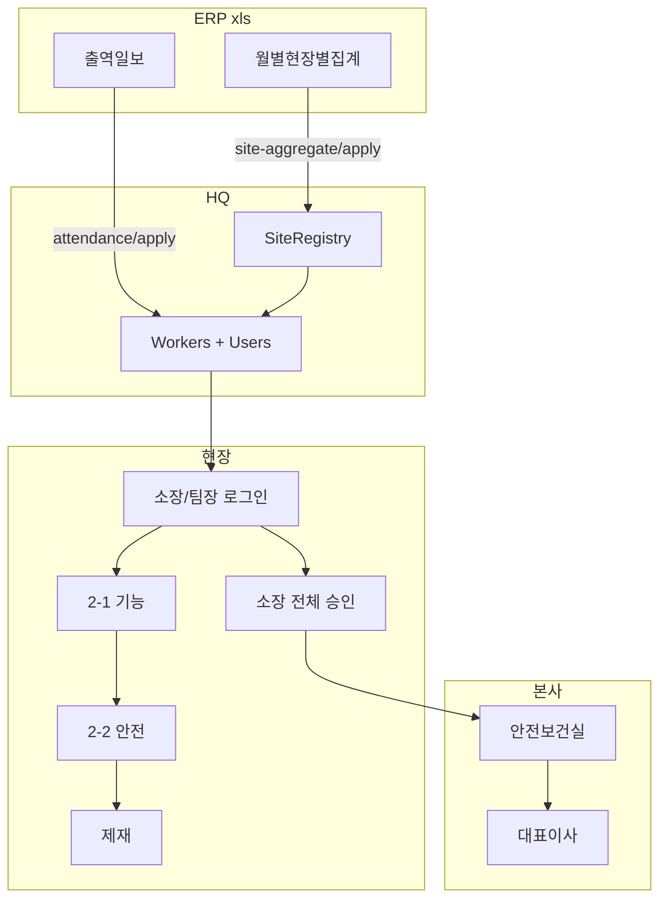

# 기능인제 인사고과 — VS Code / Cursor 병행 핸드오프

> **대상:** VS Code·Cursor에서 병행 개발하는 담당자  
> **저장소:** `d:\JSI\besma-rev`  
> **모듈 경로:** `backend/app/modules/functional_eval/` · `frontend/src/pages/functional-eval/`  
> **운영 반영 (2026-06-08):** 커밋 `be1d5ca` — 백엔드 EC2 + 프론트 Vercel 배포 완료  
> **이전 핸드오프:** `docs/HANDOFF_2026-06-04.md` (기능인제 PoC + 지게차 — 본 문서는 **기능인제만** 최신화)

---

## 1. 한 줄 요약

HQ가 ERP **월별현장별집계**·**출역일보** xls를 업로드하면 현장별 소장·팀장 계정과 당일 출역 근로자 평가 목록이 구성되고, 소장/팀장이 `별칭-이름` + 주민번호 앞 6자리로 로그인해 **2-1 기능**·**2-2 안전·제재** 인사고과를 입력한다. 소장 승인 → 안전보건실 → 대표이사 순으로 확정된다.

---

## 2. 운영 URL · 로컬 기동

| 환경 | 프론트 | API |
|------|--------|-----|
| 운영 | https://www.besma.co.kr | https://api.besma.co.kr |
| 로컬 | http://localhost:5174 | http://localhost:8001 |

```powershell
# 터미널 1 — 백엔드
cd d:\JSI\besma-rev\backend
alembic upgrade head
$env:PYTHONPATH="."
python -m uvicorn app.main:app --reload --port 8001

# 터미널 2 — 프론트
cd d:\JSI\besma-rev\frontend
npm run dev
```

**데모 계정**

| 역할 | 로그인 | 비고 |
|------|--------|------|
| HQ 안전 | `hq01` / `1111` | `/hq-safe/functional-eval` |
| 소장·팀장 | `{별칭}-{이름}` / 주민 앞 6자리 | 집계+출역 반영 후 생성 |
| 대표 최종승인 | `부현대표-김홍수` | `CEO_EVAL_LOGIN_IDS` |

**VS Code 팁**

- 워크스페이스 루트를 `besma-rev`로 연다 (상위 `JSI`만 열면 경로 혼동).
- Python: `backend`를 interpreter cwd로, `PYTHONPATH=backend` 또는 uvicorn cwd=`backend`.
- 추천 검색 키워드: `functional_eval`, `SITE_FUNCTIONAL_EVAL`, `TEAM_LEADER_SPLIT_THRESHOLD`, `needsSanctionPrompt`.

---

## 3. 화면 · 라우트

| 경로 | 파일 | 사용자 |
|------|------|--------|
| `/hq-safe/functional-eval` | `frontend/src/pages/hq/HQFunctionalEvalPage.vue` | HQ 안전 — 집계/출역 업로드, 승인, 엑셀 |
| `/site/functional-eval` | `frontend/src/pages/functional-eval/SiteFunctionalEvalPage.vue` | 소장·팀장 — 현황·평가 |
| 레이아웃 | `frontend/src/layouts/FunctionalEvalLayout.vue` | 기능인제 전용 셸 (타 SITE 메뉴 격리) |

**라우터:** `frontend/src/router/index.ts`  
- 역할 `SITE_FUNCTIONAL_EVAL` → `/site/functional-eval` 강제  
- 기능인제 로그인 시 일반 현장 메뉴(`/site/...`) 접근 차단

---

## 4. 업무 규칙 (반드시 코드와 맞출 것)

### 4-1. 평가 대상

- **당일 출역일보에 있는 근로자만** 평가 목록 (`DECISION-088`).
- 일용직 통합 명부(7천 명)는 **참조·소장 계정·site_code 매핑**용.
- 주민번호 해시(`rrn_hash`)로 재출역 시 기존 평가·제재 이력 유지.

### 4-2. 평가자 · 팀 분할

상수: `TEAM_LEADER_SPLIT_THRESHOLD = 10` (`constants.py`)

| 출역 인원(소장 제외) | 평가 구조 |
|---------------------|-----------|
| **10명 이하** | 소장이 전원 평가 (팀장 ID 없음) |
| **11명 이상** | 직영 → 소장, 팀원 → 출역일보 **대표(팀장)** 열 기준 |

**팀장 계정·배정**

| 조건 | 처리 |
|------|------|
| 대표명이 사람 이름 아님 (`직영`, `합계` 등) | 소장이 해당 팀원 평가 |
| 팀장이 **당일 출역하지 않음** (대표명만 존재) | 팀장 ID 없음, 팀원 → **소장** 배정 |
| 팀장이 당일 출역 + 주민번호 있음 | ID `{별칭}-{이름}`, PW 주민 앞 6자리 |
| ~~기존 평가 이력 없음~~ | **규칙 폐기** — 이력과 무관하게 출역·주민번호만 보면 ID 발급 |

구현: `eval_provisioning.py` `_provision_evaluators_from_attendance()`,  
계정표 생성: `scripts/generate_functional_eval_evaluator_account_sheets.py`

### 4-3. 평가 종류 · 등급

| 구분 | 양식 | 비고 |
|------|------|------|
| 2-1 기능 | `eval_catalog_data.json` FUNCTIONAL | |
| 2-2 안전 | `eval_catalog_data.json` SAFETY | |
| 제재 | `sanctions.py` + 위반 카탈로그 API | 등급·위반 연동 |

**등급:** S / A / B / C (**D 없음** — 구 DB D는 C로 표시)  
**엑셀·UI 정렬:** S → A → B → C

**제재 입력 유도** (`frontend/src/utils/functionalEvalCompletion.ts` `needsSanctionPrompt`):

- 기능·안전 모두 완료 후
- **C등급** 또는 **S 미만** → 제재 등록 필요

### 4-4. 안전·제재 UI 통합 (2026-06-08)

| 영역 | 상태 |
|------|------|
| 탭명 | `2-2 안전·제재` |
| PC 평가 | 안전표 아래 `EvalSanctionInline` 인라인 |
| 현황표 | `안전·제재 (2-2)` **한 열** (등급 + 제재/제재필요) |
| 모바일 | 안전 저장 후 제재 필요 시 **모달** (인라인 미완) |
| HQ 현황 | 안전·품질 별도 열 (통합 미완) |

현황표에서 소장 전체 보기 시 팀원 행 끝 `팀장` 문구는 **제거됨** (구분 열 `팀원`과 중복).

### 4-5. 승인 워크플로

```
평가 진행(IN_PROGRESS)
  → 소장 현장 전체 승인(SITE_APPROVED)
  → 안전보건실 승인(HQ_APPROVED)
  → 대표이사 최종(CEO_APPROVED)
  ← 어느 단계든 반려(REJECTED) → 수정 후 재진행
```

- 코드: `approval_workflow.py`, `constants.py` `APPROVAL_STATUS_*`
- 소장 승인 중에는 `evaluation_editable=false` → 평가 수정 불가
- 마감일: 기본 6/15, HQ에서 변경 가능

### 4-6. 제재 기준

`backend/app/modules/functional_eval/sanctions.py` — `DECISION-087` 제재표  
위반 코드 목록: `GET /functional-eval/violation-catalog`

---

## 5. ERP · 데이터 파일

| 파일 패턴 | 파서 | 용도 |
|-----------|------|------|
| `docs/월별현장별집계_*.xls` | `site_aggregate.py` | Site, Registry, 별칭, 소장명 |
| `docs/출역일보_*.xls` | `attendance.py` | 당일 출역, 팀장(대표), 주민번호 |
| `docs/sample/.../daily_workers_raw*` | `roster.py` `parse_daily_roster` | 직종=1 소장, 현장별 주민번호 |
| `docs/sample/.../사원리스트_*.xls` | `roster.py` `parse_employee_master` | 이름→주민번호 **보조** lookup |

**평가자 계정표 생성**

```bash
cd backend
PYTHONPATH=. python scripts/generate_functional_eval_evaluator_account_sheets.py
# 출력: docs/기능인제_평가자계정/
PYTHONPATH=. python scripts/generate_functional_eval_evaluator_account_sheets.py ../docs/new-site-deployment/현장소장계정
```

규칙 상세: `docs/기능인제_평가자계정/README.md`

---

## 6. 백엔드 코드 맵

| 파일 | 역할 |
|------|------|
| `routes.py` | REST API 전체 |
| `service.py` | 목록·직렬화·권한·승인·이력 |
| `eval_provisioning.py` | 집계/출역 반영 → Site, User, Worker, 평가자 배정 |
| `eval_catalog.py` | 2-1/2-2 문항·배점 |
| `sanctions.py` | 제재 규칙 산출 |
| `approval_workflow.py` | 현장/HQ/CEO 승인 상태기계 |
| `import_diff.py` | 명부 diff-only 반영 |
| `site_alias.py` | ERP 현장명 → 별칭, `build_eval_login_id` |
| `site_grade_workbook.py` | 현장별 기능인등급 xlsx 출력 |
| `legacy_site_grade.py` | 구 엑셀 평가 JSON 복원 |
| `roster.py` | 일용직·사원리스트 파싱 |
| `attendance.py` | 출역일보 파싱 |
| `site_aggregate.py` | 월별집계 파싱 |
| `xls_io.py` | 레거시 xls 공통 |
| `models.py` | ORM (아래 테이블) |
| `schemas.py` | Pydantic 응답 |

### DB 테이블 (`models.py`)

- `functional_eval_periods` — 시즌·마감일
- `functional_eval_site_registry` — 현장별 별칭·소장
- `functional_eval_workers` — 평가 대상 (`assigned_evaluator_login_id`, `rep_name`)
- `functional_eval_assessments` — 기능/안전 점수
- `functional_eval_sanctions` — 제재 이력
- `functional_eval_site_approvals` — 현장별 승인
- `functional_eval_attendance_entries` — 출역 스냅샷
- `*_import_batches` — 업로드 이력

### Alembic (기능인제 관련)

| Revision | 내용 |
|----------|------|
| `20260604_0060` | `functional_eval_site_registry` |
| `20260608_0061` | `functional_eval_site_approvals` + worker 컬럼 |
| `20260608_0062` | 신규현장 배포 (별도 모듈, 같이 배포됨) |
| `20260608_0063` | 신규현장 관리자 |

---

## 7. API 요약

**현장 (소장·팀장)**

```
GET  /functional-eval/my-site/workers          # 현황·평가 대상
GET  /functional-eval/eval-catalog           # 2-1 / 2-2 문항
GET  /functional-eval/violation-catalog      # 위반 항목
GET  /functional-eval/workers/{id}/assessment/{FUNCTIONAL|SAFETY}
PUT  /functional-eval/workers/{id}/assessment/{FUNCTIONAL|SAFETY}
POST /functional-eval/sanctions              # 제재 등록
GET  /functional-eval/workers/{id}/history   # 평가·제재 이력
POST /functional-eval/my-site/approval/submit  # 소장 전체 승인
GET  /functional-eval/my-site/export/site-grade-workbook
```

**HQ**

```
POST /functional-eval/hq/site-aggregate/apply   # ① 월별집계
POST /functional-eval/hq/attendance/apply       # ② 출역일보
GET  /functional-eval/hq/summary
GET  /functional-eval/hq/sites/{site_code}/evaluations
GET  /functional-eval/hq/approvals/pending
POST /functional-eval/hq/approvals/{site_code}/approve|reject
GET  /functional-eval/hq/ceo-approvals/pending
POST /functional-eval/hq/ceo-approvals/{site_code}/approve|reject
POST /functional-eval/hq/roster/diff | apply
GET  /functional-eval/hq/export/evaluations | export | evaluator-accounts
```

---

## 8. 프론트 코드 맵

| 파일 | 역할 |
|------|------|
| `SiteFunctionalEvalPage.vue` | 현황표, 탭(2-1/2-2), 승인, 제재·이력 모달 |
| `HQFunctionalEvalPage.vue` | HQ 업로드·승인·엑셀·관리 섹션 |
| `FunctionalEvalWorkspace.vue` | PC 분할 / 모바일 시트, 평가 저장 흐름 |
| `EvalAssessmentSheet.vue` | 문항별 등급 선택 |
| `EvalSanctionInline.vue` | PC 안전 탭 하단 제재 폼 |
| `functionalEvalCompletion.ts` | 완료/제재필요/등급표시/행강조/안전·제재 통합열 |

**평가 저장 흐름**

1. 2-1 기능 저장 → 자동 2-2 탭 전환 (`request-safety`)
2. 2-2 안전 저장 → `needsSanctionPrompt` 시 안내 + (모바일) 제재 모달
3. PC에서는 같은 화면 `EvalSanctionInline`

**행 강조:** C등급 또는 제재 이력 → `row-highlight--alert` (연한 붉은 배경)

---

## 9. 유틸 스크립트 · 테스트

```powershell
cd backend
$env:PYTHONPATH="."

# 테스트 (기능인제)
python -m pytest tests/test_functional_eval_routes.py `
  tests/test_functional_eval_provisioning.py `
  tests/test_functional_eval_assessment.py `
  tests/test_functional_eval_site_grade_workbook.py -v

# 운영 API 스모크 (자격 필요)
python scripts/verify_fe_eval_api.py
```

| 스크립트 | 용도 |
|----------|------|
| `generate_functional_eval_evaluator_account_sheets.py` | 소장·팀장 계정 xlsx |
| `apply_functional_eval_roster.py` | 명부 반영 |
| `repair_fe_db_schema.py` | 로컬 DB 컬럼 누락 수동 보정 |
| `seed_fe_e2e_scenario.py` | E2E 시나리오 시드 |
| `run_fe_e2e_simulation.py` | E2E 시뮬레이션 |

---

## 10. 배포

```powershell
# 백엔드 (EC2) + push
powershell -NoProfile -ExecutionPolicy Bypass -File .\deploy\deploy_all.ps1 `
  -RepoRoot d:\JSI\besma-rev -SshKeyPath C:\Users\win10\.ssh\besma-key.pem

# 프론트 (Vercel) — deploy_all만으로는 안 올라감
powershell -NoProfile -ExecutionPolicy Bypass -File .\deploy\deploy_frontend_vercel.ps1 `
  -RepoRoot d:\JSI\besma-rev
```

**주의 (2026-06-08 경험)**

- EC2에 수동 수정·미추적 파일이 있으면 `git pull` 실패 → `git fetch && git reset --hard origin/main` 후 `RUN_MIGRATIONS=1 ./deploy/deploy_backend.sh`
- 배포 전 `alembic upgrade head` 로컬 확인
- 상세: `deploy/PRODUCTION_DEPLOY_RUNBOOK.md`, `docs/OPERATIONS_DEPLOY.md`

---

## 11. 아키텍처



---

## 12. 미완 · 백로그

| 우선 | 항목 |
|------|------|
| 🟡 | 모바일: 안전표 + 제재 **한 화면** (현재 모달 분리) |
| 🟡 | HQ 현황표 안전·제재 표현 통합 |
| 🟡 | 이력 모달 — 평가/제재 섹션 통합 표현 |
| 🟡 | 제재·C등급 엑셀/HQ export 컬럼 정리 |
| 🟢 | 마일리지 API placeholder (`PREPARED`) |
| 🟢 | 네이버웍스 게시 안내 — BESMA 자동 연동 없음 |

---

## 13. 의사결정 · 참고 문서

| 문서 | 내용 |
|------|------|
| `docs/DECISION_LOG.md` | DECISION-087 (기능인제·제재), DECISION-088 (출역일보 중심) |
| `docs/기능인제_평가자계정/README.md` | 계정 생성 규칙 |
| `docs/HANDOFF_2026-06-04.md` | 초기 PoC 핸드오프 (지게차 포함) |
| `docs/reports/functional-eval-e2e/` | E2E 시뮬레이션 리포트 |

---

## 14. 병행 작업 시 체크리스트

- [ ] `alembic upgrade head` (로컬 DB)
- [ ] `docs/월별현장별집계_*.xls`, `docs/출역일보_*.xls` 최신본 존재 확인
- [ ] HQ → ①집계 → ②출역 반영
- [ ] `대우청라-박명식` 등 계정으로 `/site/functional-eval` E2E
- [ ] 11명 이상 현장에서 팀장/소장 분리·미출역 팀장 → 소장 배정 확인
- [ ] 안전·제재 통합 현황열 · PC 인라인 제재 확인
- [ ] 배포 시 **백엔드 + Vercel 둘 다**

---

*작성: 2026-06-08 · 운영 HEAD `be1d5ca` 기준 · VS Code/Cursor 병행용*
