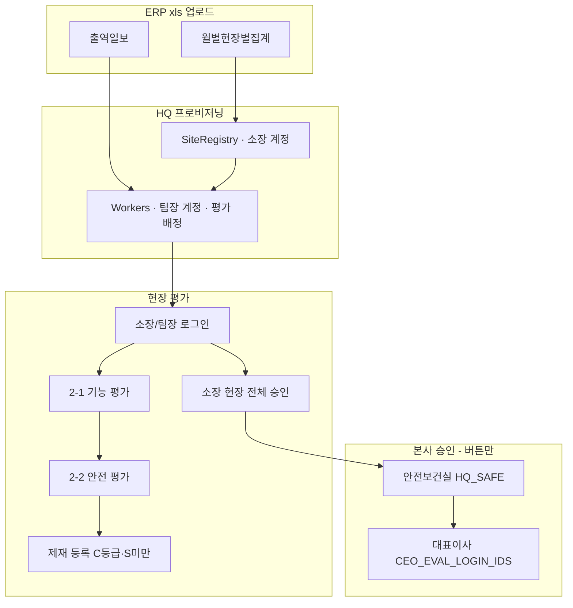
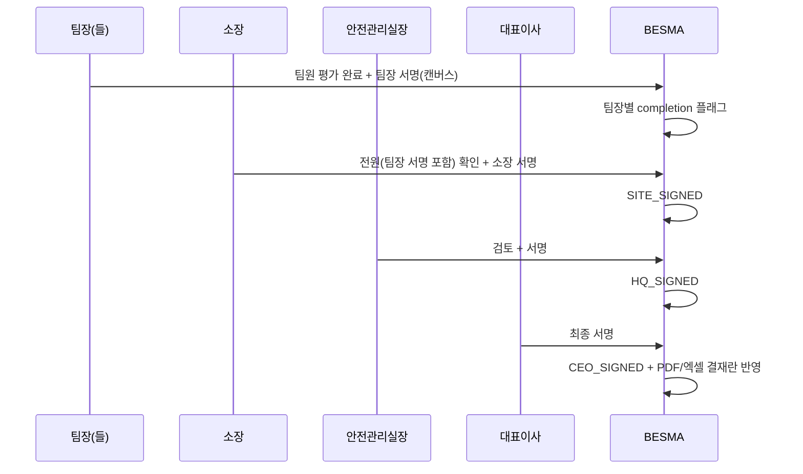

# 기능인제·서명 시스템 심층 분석 보고서

> **작성일:** 2026-06-14  
> **대상 저장소:** `d:\JSI\besma-rev`  
> **분석 범위:** 기능인제(인사고과) 모듈, PDF·근로자 서명 모듈, 4단계 결재(팀장·소장·안전관리실장·대표이사) 도입 난이도

---

## 1. Executive Summary

BESMA(besma-rev)에는 **기능인제(기능·안전 인사고과)** 와 **서명** 이 별도 모듈로 존재한다. 기능인제는 평가·승인 워크플로가 **운영 중**이나, 승인은 **버튼 클릭(상태 전이)** 수준이며 **전자서명 이미지를 수집하지 않는다**. 서명은 **PDF 1인 외부서명(임시)**, **근로자 일일작업계획 캔버스 서명** 등으로 분산되어 있다.

요청하신 **팀장 → 소장 → 안전관리실장 → 대표이사 4단계 서명 구조**는 현재 **3단계 승인(소장 → 안전보건실 → 대표)** 에 **팀장 서명 단계가 없고**, **실제 서명 캡처·PDF 반영 인프라도 미통합** 상태이다. 구현 난이도는 **중~상(6~10주)** 으로 판단되며, 최대 병목은 **(1) 서명 인프라 통합**, **(2) 팀장 다수·현장별 병렬 처리**, **(3) ERP 데이터·알림 의존** 이다.

---

## 2. 시스템 개요

| 구분 | 모듈 경로 | 운영 상태 | 핵심 역할 |
|------|-----------|-----------|-----------|
| 기능인제 | `backend/app/modules/functional_eval/` | **운영 중** (EC2+Vercel) | ERP 출역 기반 인사고과, 다단계 승인 |
| PDF 외부서명 | `backend/app/modules/pdf_signing/` | **임시(MVP 제외)** | 사고보고서 PM 1칸 PNG 오버레이 |
| 근로자 작업계획 서명 | `backend/app/modules/risk_library/` | **MVP 검증 대상** | 모바일 캔버스 서명, GPS 검증 |
| 문서·서명 연동 | `backend/app/modules/documents/` | 부분 연동 | 배포 근로자 `signature_data` 보관 |

**프론트엔드**

| 화면 | 경로 |
|------|------|
| HQ 기능인제 | `frontend/src/pages/hq/HQFunctionalEvalPage.vue` |
| 현장 기능인제 | `frontend/src/pages/functional-eval/SiteFunctionalEvalPage.vue` |
| PDF 서명(공개) | `frontend/src/pages/pdf-signing/PdfSigningPublicPage.vue` |

**참고 문서:** `docs/HANDOFF_기능인제.md`, `docs/MVP_VERIFICATION_CHECKLIST.md`

---

## 3. 기능인제 시스템 심층 분석

### 3.1 업무 흐름



### 3.2 데이터 모델

| 테이블 | 역할 |
|--------|------|
| `functional_eval_periods` | 시즌·마감일(기본 6/15) |
| `functional_eval_site_registry` | 현장코드·별칭·소장명·소장 login_id |
| `functional_eval_workers` | 평가 대상, `assigned_evaluator_login_id` |
| `functional_eval_assessments` | 2-1/2-2 점수·등급(S/A/B/C) |
| `functional_eval_sanctions` | 제재 이력 |
| `functional_eval_site_approvals` | **현장별 승인 상태기계** |
| `functional_eval_attendance_entries` | 출역 스냅샷 |

### 3.3 평가자 배정 규칙

상수 `TEAM_LEADER_SPLIT_THRESHOLD = 10` (`constants.py`)

| 출역 인원(소장 제외) | 평가 구조 |
|---------------------|-----------|
| **10명 이하** | 소장이 전원 평가 |
| **11명 이상** | 직영 → 소장, 팀원 → 출역일보 **대표(팀장)** 열 기준 |

**팀장 특수 케이스** (`eval_provisioning.py`):

- 대표명이 `직영`, `합계` 등 → 소장이 해당 팀원 평가
- 팀장이 당일 미출역 → 팀장 ID 없음, 팀원은 소장 배정
- 팀장 계정: `{별칭}-{이름}` / PW = 주민번호 앞 6자리

### 3.4 승인 워크플로 (현재)

코드: `approval_workflow.py`, `FunctionalEvalSiteApproval` 모델

```
IN_PROGRESS (평가 진행)
  → SITE_APPROVED   (소장 현장 전체 승인)
  → HQ_APPROVED     (안전보건실 승인)
  → CEO_APPROVED    (대표이사 최종)
  ← REJECTED        (HQ/CEO/SITE 단계 반려 가능)
```

| 단계 | 수행자 | API | 서명 이미지 |
|------|--------|-----|-------------|
| 현장 제출 | 소장(`manager_login_id`) | `POST /functional-eval/my-site/approval/submit` | **없음** |
| 본사 검토 | `HQ_SAFE`, `HQ_SAFE_ADMIN` | `POST .../hq/approvals/{site_code}/approve` | **없음** |
| 대표 최종 | `CEO_EVAL_LOGIN_IDS` 또는 SUPER_ADMIN | `POST .../hq/ceo-approvals/{site_code}/approve` | **없음** |

**잠금 규칙:** `SITE_APPROVED` 이후 `evaluation_editable=false` → 평가 수정 불가.

**소장 승인 조건:** 해당 현장 출역 근로자 **전원** 2-1·2-2·(필요 시)제재 완료 (`can_submit_site_approval`).

### 3.5 팀장의 현재 역할 (중요)

| 역할 | 평가 | 승인/서명 |
|------|------|-----------|
| 팀장 | 11명+ 현장에서 **담당 팀원만** 평가 | **승인 단계 없음** |
| 소장 | 직영 평가 + 전체 현황 + **현장 전체 승인** | 승인 버튼만 (서명 X) |
| 안전보건실 | HQ 화면에서 일괄 승인 | 승인 버튼만 |
| 대표이사 | CEO 전용 계정으로 최종 승인 | 승인 버튼만 |

→ **팀장은 “평가자”이지 “결재자”가 아니다.** 4단계 서명 구조를 만들려면 팀장 **완료 확인·서명** 단계를 **신규 설계**해야 한다.

### 3.6 ERP·운영 병목 (기능인제 자체)

| 병목 | 설명 | 영향 |
|------|------|------|
| ERP xls 의존 | 집계·출역 파일 없으면 계정·목록 생성 불가 | 시즌 시작 지연 |
| 출역일보 = 평가 대상 | 당일 출역자만 평가 (DECISION-088) | 명부만 있고 미출역자 제외 |
| CEO 하드코딩 | `CEO_EVAL_LOGIN_IDS = {"부현대표-김홍수"}` | 대리·복수 대표 미지원 |
| 알림 없음 | 승인 대기 시 푸시·카톡·메일 없음 | 본사·대표 병목 |
| 마감일 | `deadline_date` 경과 시 편집 차단 | 반려 후 재작업 시간 압박 |
| 현장 수 × 팀장 수 | 11명+ 현장마다 복수 팀장 | 팀장 서명 단계 추가 시 **N×M 병렬 처리** |

### 3.7 산출물 (엑셀)

`site_grade_workbook.py` — `01.*기능인등급*.xlsx` 템플릿 기반 **등급·점수 출력**.  
**결재란·서명란 필드는 코드상 채우지 않음** → 종이/수기 결재와 디지털 승인 상태가 **문서상 분리**되어 있다.

---

## 4. 서명 시스템 심층 분석

BESMA의 “서명”은 **단일 시스템이 아니라 3계열**로 나뉜다.

### 4.1 PDF 외부서명 (`pdf_signing`)

| 항목 | 내용 |
|------|------|
| 목적 | 로그인 없이 **토큰/고정 URL** 로 PDF 1회 서명 |
| UI | 문서 스크롤 확인 → 캔버스 PNG → 제출 |
| PDF 처리 | `pypdf` + `reportlab` 로 **고정 좌표**에 PNG 오버레이 |
| 좌표 | `ACCIDENT_REPORT_PM_SIGNATURE` — 사고보고 1페이지 **PM 1칸만** |
| 슬롯 | `sign1`(운영), `sign2`(테스트) 고정 URL |
| 감사 | `signer_ip`, `signer_user_agent`, `signed_sha256` |
| 한계 | **다중 서명·문서 유형별 좌표·기능인제 연동 없음** |

```python
# service.py — 단일 칸, 하드코딩
ACCIDENT_REPORT_PM_SIGNATURE = {
    "page_index": 0, "x": 312.0, "y": 692.0,
    "width": 28.0, "height": 32.0,
}
```

**상태:** MVP 체크리스트상 **“MVP 제외”**, HQ 메뉴 **맨 아래 임시** 메뉴.

### 4.2 근로자 일일작업계획 서명 (`risk_library`)

| 항목 | 내용 |
|------|------|
| API | `sign_worker_daily_work_plan`, `sign_worker_daily_work_plan_end` |
| 저장 | Base64 PNG, `signature_hash`, `start_signed_at` / `end_signed_at` |
| 검증 | GPS(lat/lng), 중복 서명 방지, `ack_status` 상태기계 |
| 규모 | 현장·일별·근로자 단위 **대량** 서명 |

→ **캔버스 서명 + 감사로그 패턴**은 성숙. 기능인제 결재에 **재사용 가능**하나 **결재자(임원)용 UI·권한·PDF 합성**은 미연결.

### 4.3 기능인제 승인 vs “서명”

| 비교 | 기능인제 승인 | PDF/근로자 서명 |
|------|---------------|-----------------|
| 사용자 확인 | 로그인 + confirm 대화상자 | 캔버스 필기 |
| 증빙 | DB 타임스탬프·user_id | PNG + hash + IP |
| 법적·감사 | “시스템 승인” 수준 | “서명 이미지” 수준 |
| PDF 반영 | 없음 | PDF 1칸 또는 없음 |

**결론:** “서명 시스템”과 “기능인제 승인”은 **아직 통합되지 않았다.**

---

## 5. 목표 구조: 4단계 서명(팀장·소장·안전관리실장·대표이사)

### 5.1 요구 vs 현재 Gap

| 순서 | 역할 | 요구(가정) | 현재 |
|------|------|------------|------|
| 1 | **팀장** | 담당 팀원 평가 완료 후 **서명/확인** | 평가만, 서명·승인 API 없음 |
| 2 | **소장** | 현장 전체 확인 후 **서명** | `submit_site_approval` 버튼, 서명 없음 |
| 3 | **안전관리실장** | 본사 검토 **서명** | `approve_hq` 버튼, 역할=HQ_SAFE |
| 4 | **대표이사** | 최종 **서명** | `approve_ceo`, 단일 login_id |

### 5.2 제안 아키텍처 (TO-BE)



**설계 선택지**

| 방안 | 설명 | 난이도 |
|------|------|--------|
| A. 승인+서명 동시 | 기존 `approve_*` 에 `signature_png` 필수 추가 | 중 |
| B. 승인 후 PDF 일괄 서명 | 기능인등급 PDF 생성 → `pdf_signing` 다중 슬롯 | 상 |
| C. 범용 결재 엔진 | `APPROVAL_TEMPLATE` + 단계별 서명 (CMS 청사진) | 최상 |

**권장:** 단기 **방안 A** (DB·API 확장) + 중기 **기능인등급 PDF 4칸 오버레이**.

---

## 6. 구현 난이도 평가

### 6.1 종합 등급

| 영역 | 난이도 | 예상 공수 | 비고 |
|------|--------|-----------|------|
| 팀장 “평가완료+서명” 단계 추가 | **중** | 1.5~2주 | 현장·팀장 N명, 상태 모델 확장 |
| 소장/HQ/CEO 서명 캡처 UI | **중** | 1~1.5주 | `PdfSigningPublicPage` 캔버스 재사용 |
| DB·API·감사로그 | **중** | 1주 | `functional_eval_site_approvals` 컬럼 또는 `approval_signatures` 테이블 |
| 소장 승인 게이트 변경 | **중** | 3~5일 | “전원 평가” → “전원 평가 + **모든 팀장 서명**” |
| 기능인등급 PDF/엑셀 결재란 | **상** | 2~3주 | 템플릿 4칸 좌표, 다중 오버레이 |
| 알림(승인/서명 대기) | **상** | 2~4주 | 네이버웍스·SMS 등 **현재 없음** |
| 범용 다단계 결재 엔진 | **최상** | 2~3개월 | CMS 설계서 수준 |

**전체 (A안 기준, 알림·PDF 포함):** 약 **6~10주** (1 FTE 백엔드+프론트 혼합)

### 6.2 단계별 세부 작업

#### Phase 1 — 데이터·워크플로 (2~3주)

1. `functional_eval_team_leader_signoffs` (period, site, team_leader_login, signed_at, signature_blob, hash)
2. 팀장 API: `POST /functional-eval/my-team/signoff`
3. `submit_site_approval` 전제: `all_team_leaders_signed`
4. `FunctionalEvalSiteApproval` 에 `site_signature_data`, `hq_signature_data`, `ceo_signature_data` (또는 정규화 테이블)
5. `approve_hq` / `approve_ceo` 에 서명 payload 필수화(옵션 → 점진 필수)

#### Phase 2 — UI (1.5~2주)

1. 현장: 팀장용 “팀원 평가 완료 · 서명” 패널
2. 소장: 서명 캔버스 + “현장 전체 승인”
3. HQ/CEO: `HQFunctionalEvalPage` 승인 모달에 서명
4. 승인 이력 화면에 서명 썸네일·타임스탬프

#### Phase 3 — 문서·알림 (2~4주)

1. 기능인등급 xlsx/PDF 템플릿 결재란 4칸 정의
2. `overlay_signature_on_pdf` 다중 칸·문서 유형 registry
3. 승인 대기 큐 알림 (이메일/웍스 — **신규 인프라**)

---

## 7. 전체 병목 분석

### 7.1 병목 우선순위 매트릭스

| 순위 | 병목 | 유형 | 심각도 | 완화 방안 |
|------|------|------|--------|-----------|
| 1 | **서명 인프라 미통합** | 기술 | 🔴 높음 | 공통 `SignatureCapture` + 저장 스키마 |
| 2 | **팀장 다수·현장별 병렬** | 조직·규모 | 🔴 높음 | 팀장 signoff 테이블, 소장 대시보드 “미서명 팀장” |
| 3 | **알림 부재** | 운영 | 🔴 높음 | HQ/CEO 대기 목록 의존 → 마감 직전 쏠림 |
| 4 | **ERP 업로드 선행** | 데이터 | 🟠 중 | 집계·출역 지연 = 전체 시즌 지연 |
| 5 | **엑셀/PDF 결재란 불일치** | 감사 | 🟠 중 | 디지털 서명 후 PDF 자동 생성 |
| 6 | **CEO 단일 계정** | 거버넌스 | 🟡 중 | 역할 기반 + 복수 승인자 또는 대리 |
| 7 | **PDF 좌표 하드코딩** | 기술 | 🟡 중 | 문서 유형별 config JSON |
| 8 | **모바일 HQ/CEO UX** | UX | 🟡 중 | 임원 모바일 서명·승인 |
| 9 | **반려 후 재서명** | 프로세스 | 🟡 중 | REJECTED 시 하위 단계 서명 무효화 규칙 |
| 10 | **네이버웍스 미연동** | 운영 | 🟢 (백로그) | HANDOFF 명시 |

### 7.2 프로세스 병목 (운영 관점)

```
[ERP 업로드 지연]
       ↓
[팀장·소장 평가 지연] ←── 11명+ 현장: 팀장 수 × 팀원 수
       ↓
[팀장 서명 미구현 시] 소장이 “팀장 평가만” 보고 일괄 승인 → 책임 소재 불명
       ↓
[본사 승인 대기] ←── 알림 없음, CEO 1인
       ↓
[마감일 6/15] ←── PERIOD_CLOSED
```

### 7.3 기술 부채가 미래 구현을 막는 지점

1. **`approval_workflow.py`** — 3단계 고정 enum, 팀장 단계 삽입 시 **상태기계 전면 수정**
2. **`pdf_signing`** — 1서명·1좌표·사고보고 전용
3. **`CEO_EVAL_LOGIN_IDS`** — login_id 화이트리스트 (RBAC 아님)
4. **기능인제 ↔ BTMS Safety Desk** — 데스크톱과 **별 저장소**, 통합 시 이중 개발 위험 (본 보고서는 besma-rev 기준)

---

## 8. 리스크·의사결정 필요 사항

| # | 질문 | 영향 |
|---|------|------|
| 1 | 팀장 서명은 **팀원 전원 평가 완료** 후만 가능한가? | 게이트 로직 |
| 2 | 10명 이하 현장은 팀장 단계 **생략**인가? | 상태기계 분기 |
| 3 | “서명”은 **법적 필수**인가, **내부 확인** 수준인가? | 저장·보관 기간·암호화 |
| 4 | 안전관리실장 = `HQ_SAFE` **단일 역할**인가, 실장 1인 지정인가? | 권한 모델 |
| 5 | 최종 산출물은 **엑셀·PDF·둘 다**인가? | Phase 3 범위 |
| 6 | 대표 부재 시 **대리 서명** 허용 여부 | CEO_EVAL 확장 |

---

## 9. 권고 로드맵

| 단계 | 기간 | 산출 |
|------|------|------|
| **0. 의사결정** | 1주 | 팀장 서명 필수 여부, 10명 이하 예외, 문서 형식 |
| **1. MVP 서명 결재** | 3주 | 팀장 signoff + 4단계 PNG 저장 + 소장 게이트 |
| **2. 임원 UX** | 2주 | HQ/CEO 서명 UI, 미완료 대시보드 |
| **3. PDF 결재란** | 2~3주 | 기능인등급 4칸 자동 기입 |
| **4. 알림** | 2~4주 | 웍스/메일 (선택) |

**Quick Win (1주):** 소장/HQ/CEO 승인 API에 **선택적** `signature_png_base64` 저장만 추가 → UI는 Phase 2에서 필수화. 팀장 signoff는 별도 테이블로 먼저 도입.

---

## 10. 부록 — 주요 코드 위치

| 기능 | 파일 |
|------|------|
| 승인 상태기계 | `functional_eval/approval_workflow.py` |
| 승인 상수·CEO ID | `functional_eval/constants.py` |
| 소장 승인 조건 | `functional_eval/service.py` → `serialize_site_approval_summary` |
| 팀장 프로비저닝 | `functional_eval/eval_provisioning.py` |
| 현장 승인 UI | `SiteFunctionalEvalPage.vue` |
| HQ·CEO 승인 UI | `HQFunctionalEvalPage.vue` |
| PDF 서명 오버레이 | `pdf_signing/service.py` |
| 근로자 캔버스 서명 | `risk_library/service.py` → `sign_worker_daily_work_plan` |
| 공개 서명 UI | `PdfSigningPublicPage.vue` |

---

## 11. 결론

- **기능인제**는 ERP 연동·평가·3단계 **승인(버튼)** 까지 **성숙**했다. **팀장은 평가자**이며 **결재/서명 주체가 아니다.**
- **서명 시스템**은 PDF 1인 임시·근로자 대량 서명으로 **분리**되어 있고, 기능인제와 **연결되지 않았다.**
- **팀장·소장·안전관리실장·대표이사 4단계 서명**은 (1) 팀장 signoff 신규, (2) 공통 서명 저장·UI, (3) PDF/엑셀 결재란, (4) 알림 — 네 축이 필요하며, **핵심 병목은 서명 인프라 통합·팀장 다수 처리·알림 부재**이다.
- **현실적 1차 목표:** DB+API+캔버스로 4단계 서명 수집(6~10주). **2차:** 기능인등급 PDF 자동 결재란 + 임원 알림.

---

*본 보고서는 2026-06-14 코드베이스 정적 분석 기준. 운영 URL: https://www.besma.co.kr*
